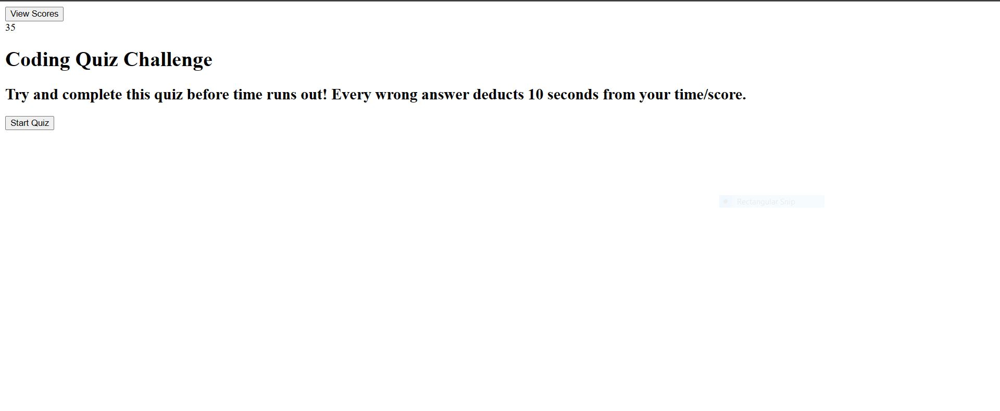

# my-code-quiz-challenge

## Description
This is a simple coding quiz challenge that generate HTML pages using Javascript DOM and event listeners.

## Image Mockup

## Link to Site
[Quiz Site Link](https://akim47.github.io/my-code-quiz-challenge/)

## Things to do:
* page stylings
* order scoreboard by score
* comment pages
